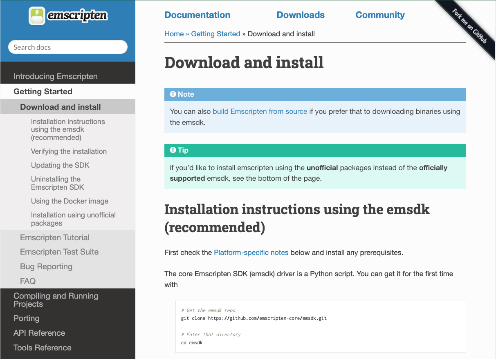

# 将C/C++模块编译到WebAssembly

当你用 C/C++ 等语言编写了一个新的代码模块时，你可以使用 Emscripten 等工具将其编译成 WebAssembly。让我们看看它是如何工作的。

# Emscripten 环境设置

使用以下说明获取 Emscripten SDK：
https://emscripten.org/docs/getting_started/downloads.html



# 编译示例

环境搭建好后，我们来看看如何使用它来编译一个 C 示例到 Wasm。使用 Emscripten 进行编译时，有许多选项可用，但我们将介绍的主要两种场景是：

- 编译为 Wasm 并创建 HTML 来运行我们的代码，以及在 Web 环境中运行 Wasm 所需的所有 JavaScript代码。
- 编译为 Wasm 并创建 JavaScript。
  
## 创建 HTML 和 JavaScript

这是我们将要研究的最简单的情况，通过它，你可以让 emscripten 生成在浏览器中运行代码所需的一切，作为 WebAssembly。

1. 首先，我们需要一个示例来编译。复制以下简单的 C 示例，并将其保存在本地驱动器上新目录中调用 hello.c 的文件中：
   
```c++
#include <stdio.h>

int main() {
    printf("Hello World\n");
    return 0;
}

```

2. 现在，使用用于进入 Emscripten 编译器环境的终端窗口，导航到 hello.c 与文件相同的目录，然后运行以下命令：
   
```bash
emcc hello.c -o hello.html
```
我们随命令传入的选项如下：
- `-o hello.html` — 指定我们希望 Emscripten 生成一个 HTML 页面来运行我们的代码（以及要使用的文件名），以及 Wasm 模块和 JavaScript“胶水”代码来编译和实例化 Wasm，以便它可以在 Web 环境中使用。

此时，在源目录中，您应该具有：
- 二进制 Wasm 模块代码 （ `hello.wasm` ）
- 一个 JavaScript 文件，其中包含用于在本机 C 函数和 JavaScript/Wasm 之间转换的粘附代码 （ `hello.js` ）
- 一个 HTML 文件，用于加载、编译和实例化 Wasm 代码，并在浏览器中显示其输出 （ `hello.html` ）

# 使用自定义 HTML 模板

有时，您需要使用自定义 HTML 模板。让我们看看如何做到这一点。

1. 首先，将以下 C 代码保存在名为 hello2.c 的文件中，在新目录中：

```cpp
#include <stdio.h>

int main() {
    printf("Hello World\n");
    return 0;
}

```

2. 在 emsdk 存储库中搜索该文件 `shell_minimal.html` 。将其复制到上一个新目录中调用 `html_template` 的子目录中。

3. 现在导航到您的新目录（同样，在您的 Emscripten 编译器环境终端窗口中），并运行以下命令：
   
```bash
emcc -o hello2.html hello2.c -O3 --shell-file html_template/shell_minimal.html
```

这次我们传递的选项略有不同：
- 我们已经指定 `-o hello2.html` 了 ，这意味着编译器仍将输出 JavaScript 胶水代码和 `.html` .

- 我们指定 `-O3` 了 ，用于优化代码。Emcc 具有与任何其他 C 编译器一样的优化级别，包括： `-O0` （无优化）、 `-O1` 、、 `-Os` 、 `-Oz -Og -O2` 、和 `-O3` 。 `-O3` 是发布版本的良好设置。

- 我们还指定 `--shell-file html_template/shell_minimal.html` 了 — 这提供了要用于创建将运行示例的 HTML 的 HTML 模板的路径。

4. 现在让我们运行这个例子。上面的命令将生成 `hello2.html` ，它将具有与模板大致相同的内容，并添加一些胶水代码以加载生成的 Wasm、运行它等。在浏览器中打开它，您将看到与上一个示例大致相同的输出。


# [原文](https://developer.mozilla.org/en-US/docs/WebAssembly/C_to_wasm)
