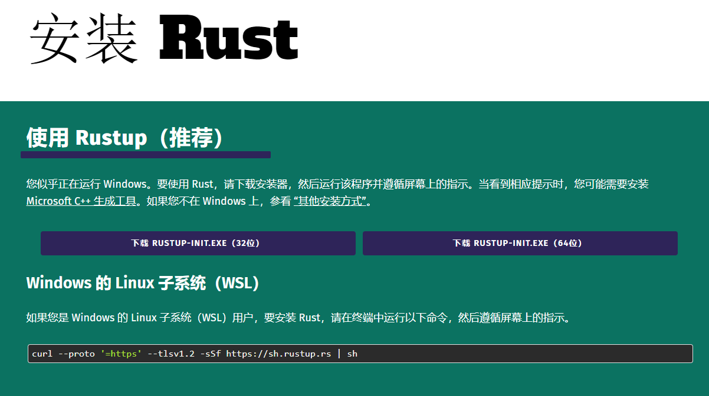
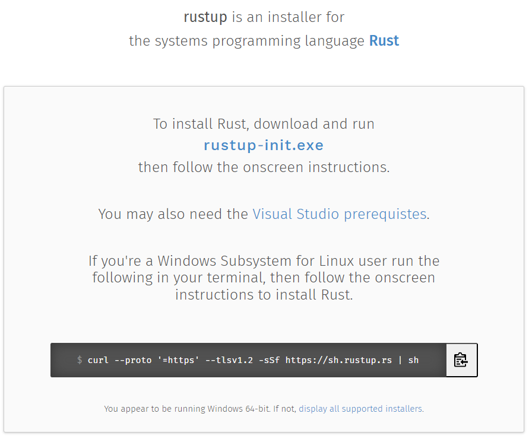

# Rust简介
## 什么是Rust 

Rust 是一种开放源代码系统编程语言，可用于开发高效、安全的软件。 使用 Rust 可管理内存并控制其低级详细信息。 但你也可以利用迭代和接口等高级概念。 这些功能将 Rust 与 C 和 C++ 等底层语言区分开来。

Rust 还具有以下优点，非常适合各种应用程序：

* 类型安全：编译器可确保不会将任何操作应用于错误类型的变量。
* 内存安全：Rust 指针（称为“引用”）始终引用有效的内存。
* 无数据争用：Rust 的 borrow 检查器通过确保程序的多个部分不能同时更改同一值来保证线程安全。
* 零成本抽象：Rust 允许使用高级别概念，例如迭代、接口和函数编程，将性能成本控制在最低，甚至不会产生成本。 这些抽象的性能与手工编写的底层代码一样出色。
* 最小运行时：Rust 具有极小的可选运行时。 为了有效地管理内存，此语言也不具有垃圾回收器。 在这一点上，Rust 非常类似于 C 和 C++ 之类的语言。
* 面向裸机：Rust 可以用于嵌入式和“裸机”编程，因此适合用于编写操作系统内核或设备驱动程序。
  
根据 [2023 年的 Stack Overflow 开发人员调查](https://survey.stackoverflow.co/2023/#overview?azure-portal=true)，Rust 已经连续几年成为最受欢迎的语言。 开发人员喜欢 Rust 的编程！ 许多类型的组织（从初创公司到大型企业）都在其独特的用例中使用 Rust。 从生成工具到编写 Web 应用、在服务器上工作，以及创建嵌入式系统，有无限的可能。

# 环境安装与搭建
[进入官网](https://www.rust-lang.org/zh-CN/tools/install), 下载对应的软件的进行安装。

安装 Rust 的建议方法是使用 Rust 工具链安装程序 rustup。
请到网站 rustup.rs 查找操作系统的相应说明。

Rust 有着以 6 星期为周期的 快速版本迭代机制，如果您曾经安装过 rustup，可以执行 rustup update 来升级 Rust。
安装完成以后在控制台输入：
